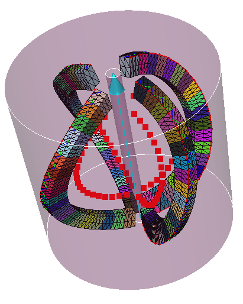

##################################################################
Ball mill
##################################################################

Geometry
*********************************

The geometry, and associated parameters, of a ball mill are defined as follows:

Script example
*********************************

.. literalinclude:: script/Test_ball_mill.py
    
Obtained tool:

