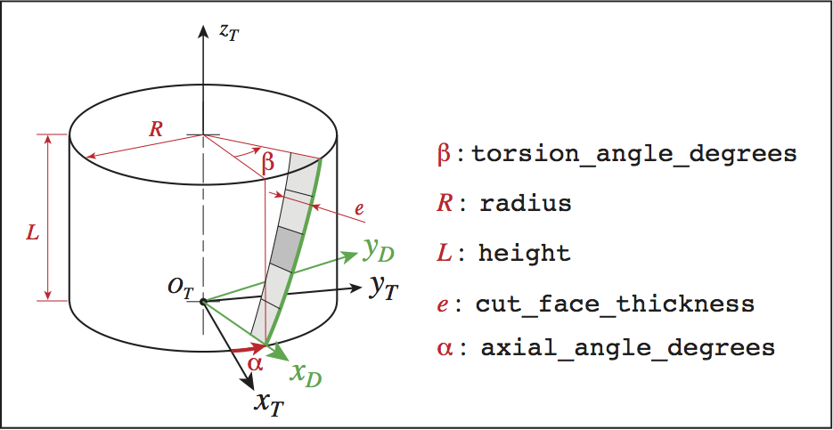

###############################################################
Tooth_cylindrical_mill
###############################################################

This is an example of python scrip that create a cylindrical mill:

::
    
    # -*- coding: Utf-8 -*-
    
    my_tooth = tooth.Tooth_cylindrical_mill(
                        # Mandatory data : 
                        name = 'toothMonoblocTyp1',
                        radius                   = 3.6E-3,
                        cut_face_thickness       = 1.E-3,
                        height                   = 2.E-3,
                        nb_elementary_tools      = 3,
                        mcr_rf_cl_name = "MCL1",
                        # optional data :
                        torsion_angle_degrees    = 20., # default: 0.0
                        cut_face_nb_layers       = 2, # default: 1
                        nb_slices                = 4, # default: 1
                        # mandatory data if clearance volume is present
                        clearance_face_angle_degrees = 5.,
                        clearance_face_thickness = 0.5E-3,
                        mcr_cv_cl_name = "MCV1",
                        # optional data if clearance volume is present
                        clearance_face_nb_layers = 1, # default: 1
                        )
    
    # my_tooth.draw()
    
    my_tool = tool.Tool(name = 'Cylindrical_mill')
    
    for angle in [0., 60., 120., 180., 240., 300.  ]:
        frame = my_tool.base_toolstep.foref.create_frame(name =  "tooth"+str(int(angle)),
           father_frame_name = "Canonical",
           frame_type        = FoR.FRAME_CYLINDRIC_NRA,
           axial_angle_degrees = 30. + angle,
           radius              = 0.,
           axial_position      = 0.,
           rot_normal_degrees = 0.,
           rot_radial_degrees = 0.,
           rot_axial_degrees  = 0.)
        my_tool.addTooth(my_tooth, frame)
    
    my_tool.write('Cylindrical_mill')
    my_tool.draw()
    

On the figures below you can see parameters used in the script:

.. image:: fig/FraiseHelicoidaleParties.png
    :align: center
    :width: 12 cm
