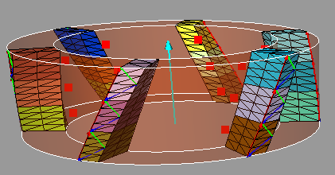

###############################################################
Cylindrical mill
###############################################################

Geometry
*********************************

The geometry, and associated parameters, of a cylindrical mill are defined as follows:

.. image:: fig/cylindrical_mill_type1.png
    :align: center
    :width: 12 cm

.. image:: fig/FraiseHelicoidaleParties.png
    :align: center
    :width: 12 cm

Script example
*********************************

.. literalinclude:: script/Test_cylindrical_mill.py
        
Obtained tool:

