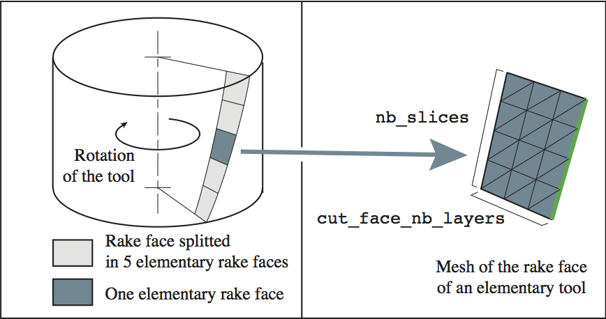
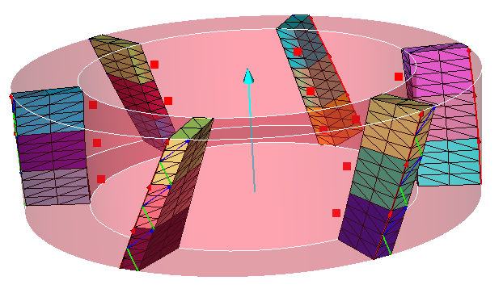

###############################################################
Cylindrical mill
###############################################################

Geometry
*********************************

The geometry, and associated parameters, of a cylindrical mill are defined as follows:

Script example
*********************************

.. literalinclude:: script/Test_cylindrical_mill.py
        
Obtained tool:

