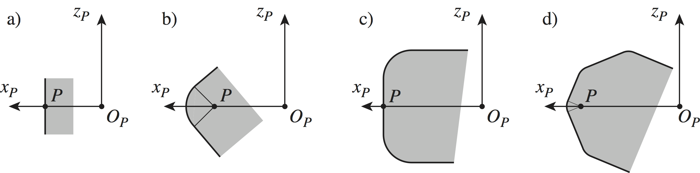
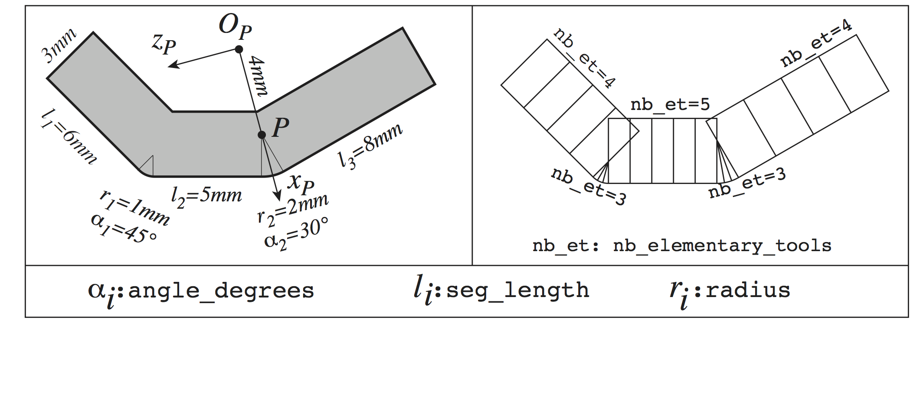
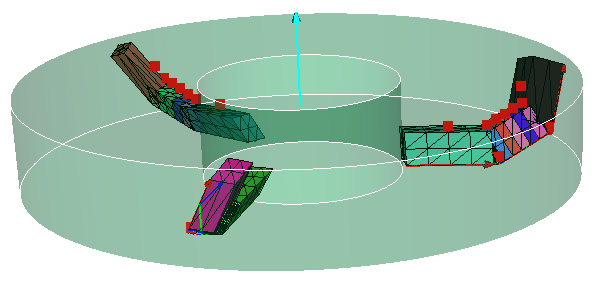

################################################################
Tool with insert teeth
################################################################

A frame :math:`(O_P,\overrightarrow{x}_P,\overrightarrow{y}_P,\overrightarrow{z}_P)` is associated to each insert.
The location of the cutting edge is defined inside the plane :math:`(O_P,\overrightarrow{z}_P,\overrightarrow{x}_P)` (that implies that the cutting edge remains inside a plane !).

Cutting egde geometry
*********************************
    
    * the cutting edge of an insert tooth is a continuous chain alternating straight segments and circular arcs (see figure bellow),
    * this chain always begin with a segment,
    * the length a one or more segments may be null, and so may be the radius of the arcs,
    * entities are numbered counter clockwise.

Cutting edge positioning 
****************************************
    
    * the position of the chain with respect to the axis  :math:`(0_P,\overrightarrow{x}_P)` is defined as being:
    
        * the perpendicular bisector of a segment of the chain, this segment is defined by its index (value associated to the dictionary key ``mediatrice_seg_idx``), the point :math:`P` is then the intersection between :math:`(0_P,\overrightarrow{x}_P)` and this segment,
        * OR the bisector of a the circular arc of the chain, this arc is defined by its index (value associated to the dictionary key ``bissectrice_arc_idx``), the point :math:`P` is then the centre of the circular arc, 
    
    * the position of point :math:`P` inside the plane :math:`(O_P,\overrightarrow{z}_P,\overrightarrow{x}_P)` is defined by:
        
        * :math:`\overrightarrow{O_PP} = L \overrightarrow{x}_P`, where :math:`L` is an algebraic length defined by the value associated to the dictionary key ``dist_from_origin``.

Example of a "complex" insert tooth:

Script example
*********************************

::
    
    # -*- coding: Utf-8 -*-
    
    my_insert_dic = {
        # Mandatory data : 
        'name' : 'ma plaquette',
        'cutting_edge_geom': [
            {'seg_length': 6.0e-3, 
             'nb_elementary_tools': 1, 'nb_slices': 1},
            {'radius': 1.E-3, 'angle_degrees': 45, 
             'nb_elementary_tools': 3, 'nb_slices': 4},
            {'seg_length': 5.0e-3,
             'nb_elementary_tools': 5, 'nb_slices': 1},
            {'radius': 2.0e-3, 'angle_degrees': 30, 
             'nb_elementary_tools': 3, 'nb_slices': 3},
            {'seg_length': 8.0e-3,
             'nb_elementary_tools': 1, 'nb_slices': 4} ],
        'insert_location': {'mediatrice_seg_idx':0 , 
                            #'bissectrice_arc_idx': 1,
                            'dist_from_origin':4.0e-3 },
        'cut_face_thickness' : 3.E-3,
        'mcr_rf_cl_name' : 'mcl_rake_face',
        # optional data :
        'cut_face_nb_layers' : 2, # default: 1
        # Mandatory if clearance volume is given:
        'clearance_face_thickness' : 2.E-3,
        'clearance_face_angle_degrees' : 30.,
        'mcr_cv_cl_name' : 'mcl_rake_face',
        # Option for clearance volume :
        'clearance_face_nb_layers' : 2, # default: 1
    }
    
    my_insert = tooth.Tooth_insert(**my_insert_dic) #Arc)
    
    my_insert.draw()
    
    my_tool = tool.Tool(name = 'inserts_mill')
    for angle in range(0,360, 120):
        frame = my_tool.base_toolstep.foref.create_frame(
               name =  "tooth"+str(angle),
               father_frame_name   = "Canonical",
               frame_type          = FoR.FRAME_CYLINDRIC_NRA,
               axial_angle_degrees = 30. + angle,
               radius              = 2.E-2,
               axial_position      = 0.,
               rot_normal_degrees  = 20.,
               rot_radial_degrees  = -30.,
               rot_axial_degrees   = 0.)
        my_tool.addTooth(my_insert, frame)
    
    my_tool.write('inserts_mill')
    my_tool.draw(2)

Obtained tool:

