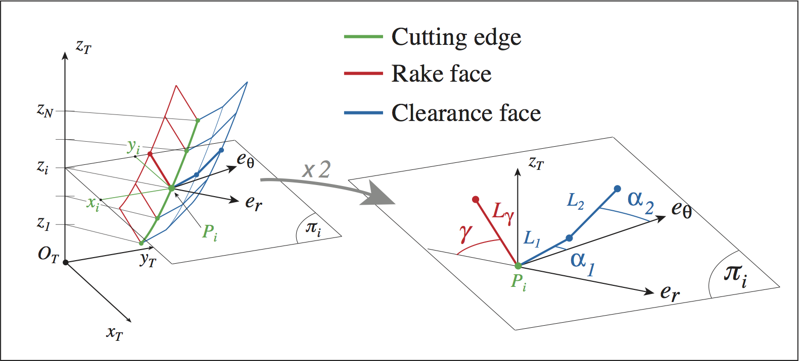
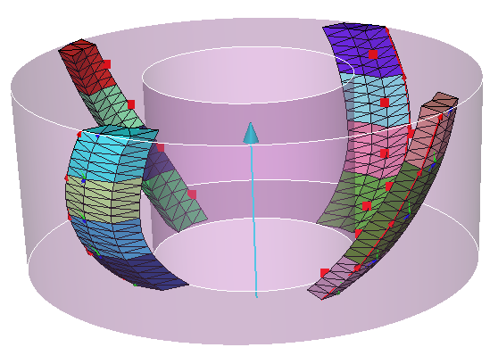

##############################################################
Sliced mill
##############################################################

Geometry
*********************************

The geometry, and associated parameters, of one slice of a tooth belonging to a sliced mill 
are defined as follows:

where :math:`R_T=(0_T,\overrightarrow{x}_T,\overrightarrow{y}_T,\overrightarrow{z}_T)` is the frame associated to the tool.
The value of these parameters are written in an ascii file ``file.gtooth`` structured as follows:

::

    N
    z_1  x_1  y_1  gamma_1  L_gamma_1  alpha_1_1  L_1_1  alpha_2_1  L2_1
    ...                                                                   
    z_i  x_i  y_i  gamma_i  L_gamma_i  alpha_1_i  L_1_i  alpha_2_i  L2_i
    ...                                                                   
    z_N  x_N  y_N  gamma_N  L_gamma_N  alpha_1_N  L_1_N  alpha_2_N  L2_N

where: 

    * ``N`` is the number of slices,
    * ``z_i`` is the position (along :math:`\overrightarrow{Z}_T`) of slice ``i``,
    *  ``x_i`` and ``y_i`` define the position of the current point ``P_i`` of the cutting egde inside :math:`R_T`,
    * :math:`\gamma_i` gives the orientation of the rake face, and  :math:`L_{\gamma i}` gives its width (inside the plane :math:`\pi_i`),  
    * :math:`\alpha_{1i}` gives the orientation of the primary clearance face, and :math:`L_{1i}` gives its width (inside the plane :math:`\pi_i`),
    * :math:`\alpha_{2i}` gives the orientation of the primary clearance face, and :math:`L_{2i}` gives its width (inside the plane :math:`\pi_i`).
    * If :math:`L_{1i} = 0.0` there is no primary clearance face (and no secondary !),
    * If :math:`L_{2i} = 0.0` there is no secondary clearance face.

Angles are given in degrees.

Script example
*********************************

::
    
    # -*- coding: Utf-8 -*-
    
    file_gtooth = 'sliced_tooth.gtooth'
    bm_tooth = tooth.Tooth_sliced(
                             # Mandatory data :    
                             name = 'ball_mill_tooth',
                             cutting_edge_geom = file_gtooth,
                             nb_elementary_tools = 4,
                             nb_slices_per_elt = 5,
                             clearance_face1_nb_layers = 1,
                             clearance_face2_nb_layers = 1,
                             mcr_rf_cl_name = 'mcl_cut_face', 
                             cut_face_thickness= 1.E-3,
                             # Optional data :
                             cut_face_nb_layers = 1, # default: 1
                             mcr_cv_cl_name = 'mcl_clear_face'  # if not specified, clearance volume is
                                                            # not generated
    )
    
    bm_tooth.draw()
    
    bm_tool = tool.Tool(name = 'ball_mill_tool')
    for angle in range (0, 360, 90):
        frame = bm_tool.base_toolstep.foref.create_frame(name =  "tooth_"+str(angle),
           father_frame_name = "Canonical",
           frame_type       = FoR.FRAME_CYLINDRIC_NRA,
           axial_angle_degrees = 0.,
           radius              = 0.,
           axial_position      = 0.,
           rot_normal_degrees = 0.,
           rot_radial_degrees = 0.,
           rot_axial_degrees  = angle )
        bm_tool.addTooth(bm_tooth, frame)
    
    bm_tool.write('sliced_ball_mill')
    
    bm_tool.draw(2)
    
Obtained tool:

