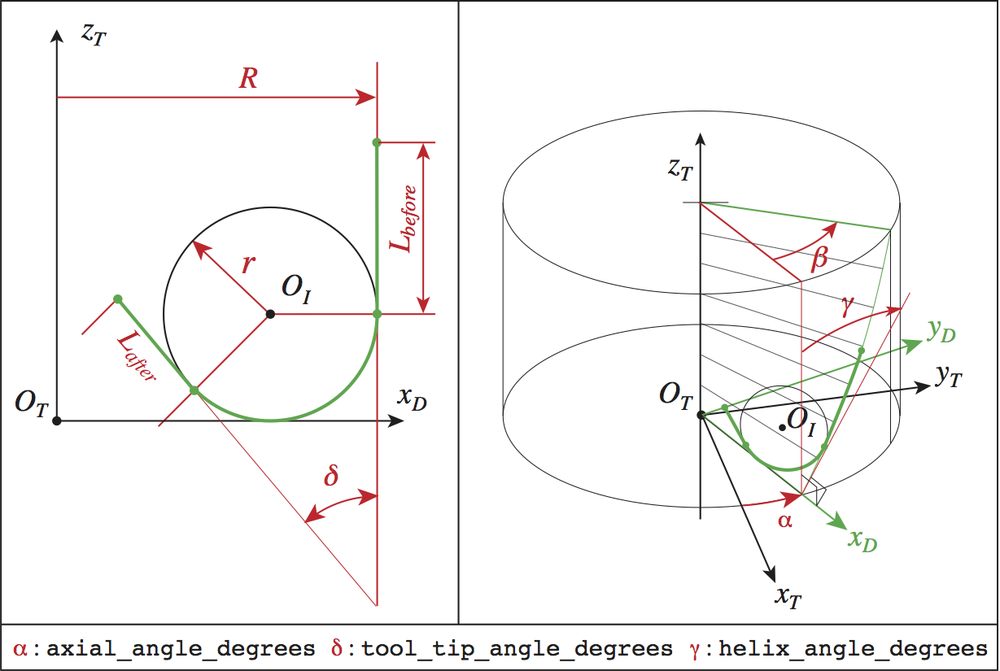

####################################################################################################
Tooth_toroidal_mill
####################################################################################################
This is an example of python scrip that create a toroidal mill :
::
    # -*- coding: Utf-8 -*-

    my_tooth = tooth.Tooth_toroidal_mill(
            # Mandatory data : 
            name                    = 'toothMonoblocTyp1', 
            dist_from_origin        = 6.0E-3, ## futur radiurs of the mill...
            tool_tip_radius         = 3.E-3,
            tool_tip_angle_degrees  = 110.0,
            lenght_before           = 5.E-03,
            lenght_after            = 0.0,
            seg_nb_elem_tool_before = 5, 
            seg_nb_elem_tool_after  = 0, 
            arc_nb_elem_tool        = 5,
            cut_face_thickness      = 1.E-3, ##
            mcr_rf_cl_name          = "MCL1",
            # optional data :
            helix_angle_degrees     = 10.0, # default: 0.
            cut_face_nb_layers      = 2,     # default: 1 ##
            seg_nb_slice_before     = 1,     # default: 1       
            seg_nb_slice_after      = 1,     # default: 1
            arc_nb_slices           = 2,     # default: 1   
        
            # mandatory data if clearance volume is present
            clearance_face_angle_degrees = 5.,
            clearance_face_thickness     = 0.5E-3,
            mcr_cv_cl_name               = "MCV1",
            # optional data if clearance volume is present
            clearance_face_nb_layers     = 1, # default: 1 
            )
         
    # my_tooth.draw()

    my_tool = tool.Tool(name = 'toroidal_mill')
    for angle in [0., 60., 120., 180., 240., 300.  ]:
        frame = my_tool.base_toolstep.foref.create_frame(name =  "tooth"+str(int(angle)),
           father_frame_name  = "Canonical",
           frame_type          = FoR.FRAME_CYLINDRIC_NRA,
           axial_angle_degrees = 30.,
           radius              = 0.,
           axial_position      = 0.,
           rot_normal_degrees = 0.,
           rot_radial_degrees = 0.,
           rot_axial_degrees  = angle)
        my_tool.addTooth(my_tooth, frame)

    my_tool.write('toroidal_mill')
    my_tool.draw(2)
    

    

On the figures below you can see parameters used in the script :

