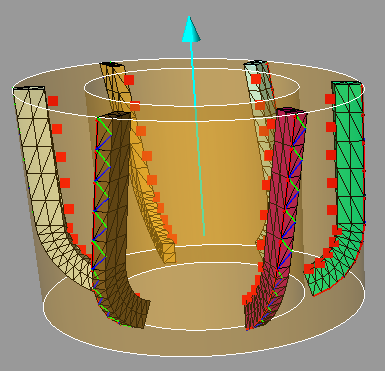

##################################################################
Toroidal mill
##################################################################

Geometry
*********************************

The geometry, and associated parameters, of a toroidal mill are defined as follows:

.. image:: fig/toroidal_mill_type2.png
    :align: center
    :width: 12 cm

Script example cgen example
*********************************

.. literalinclude:: script/Test_toroidal_mill.py

Obtained tool:

    

