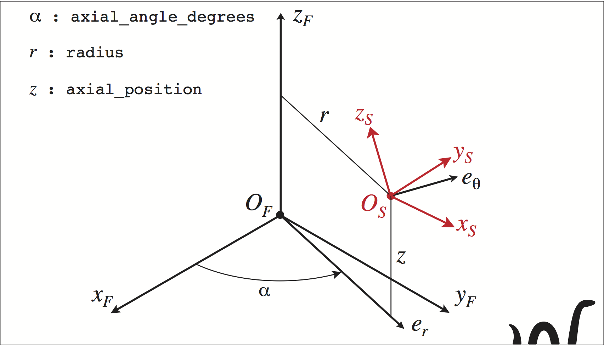

################################################################################
Script explanations
################################################################################

The **tool** python package consists of tree python modules:
    * the ``tooth`` module where every tooth type is defined,
    * the ``toolstep`` module manages the toolsteps of the tools,
    * the ``tool`` module allows to create the tools.

The **tool** package need an other module called ``FoR`` (short for "Frame of Reference") managing the positioning of the teeth inside the toolsteps or the toolsteps inside the tools. 

The **tool** pyhton package has been thought in *Object-oriented programming*. 

For example in the script above, ``toothInsert = tooth.Tooth_insert(…)`` create a new *object* that is an *instance* of the *class* ``Tooth_insert`` defined in the module ``tooth``, and assign the variable ``toothInsert`` with the *object* newly created.

********************************************************************************
Module ``tooth``
********************************************************************************

The module ``tooth`` offers five classes to create teeth :
    
* ``Tooth_insert``
* ``Tooth_toroidal_mill``
* ``Tooth_cylindrical_mill``
* ``Tooth_ball_mill``
* ``Tooth_sliced``

Next topics will detail those five classes.

The class inheritance system in Object-oriented programming, offers here 2 things :

* each ``Tooth_*`` class above have in common 2 *methods* :
    * ``my_tooth.draw()`` draw the tooth ``my_tooth`` in a 3D window.
    * ``my_tooth.torsion_transformation()`` applies a tortion transfomation to the tooth ``my_tooth``
* every object that is an instance of a class ``Tooth_*`` can be added to a toolstep or a tool.

********************************************************************************
Module ``toolstep``
********************************************************************************

The module toolstep contain the class ``toolstep.ToolstepModel``. 
This class is for defining the toolsteps of a tool.
To create a toolstep, you call the ToolstepModel constructor :

::

    my_toolstep = toolstep.ToolstepModel(name = 'optional name for the toolstep')

**Fields:**

Every toolstep has an important field named ``foref``.  This field is an *object* that represent the frame of reference of the toolstep in which you will define the frames to position the teeth.

So, to create a frame in a toolstep, you can call his method ``create_frame`` which return a new object frame:

::
    
    frame = my_toolstep.foref.create_frame(**args)
    
The args will be detailed in the frame section of this document.

**Methods:**

A toolstep (instance of the class ``toolstep.ToolstepModel``) has 2 methods :

* ``my_toolstep.draw()`` Draw the toolstep in a 3d window.
* ``my_toolstep.addTooth(...)`` Add a tooth to my_toolstep. This method accept 3 named arguments :
    * ``tth`` : the tooth, 
    * ``frame`` : the frame, 
    * ``set_id`` : optional argument. Add it if you want the tooth to belong to a set of teeth (default value : ``set_id = None`` : no set is defined ).

********************************************************************************
Module ``tool``
********************************************************************************

The module ``tool`` offers the class ``tool.Tool``.
The constructor of the class ``tool.Tool`` create a new empty tool. 
After you create a new empty tool, you can fill it with toolsteps that contain teeth. 

To create a new tool, you can write :

::

    my_tool = tool.Tool(name = 'a name for the tool')
    
The parameter name is optional and its default value is "Tool_<number>"
where <number> is given by an instance counter in the class ``tool.Tool``.
This name will be used to define the file name of the generated ***data***. 

**Fields:**

Every tool (instance of the class ``tool.Tool``) has the following fields :

* ``foref``: the frame of reference of the tool in which you can create the frames.
* ``base_toolstep``: this is an instance of the class ``toolstep.ToolstepModel``. This is the base toolstep of the tool in which you can add teeth. This toolstep has his own ``foref`` in which you can create frames to position teeth.
    
**Methods:**

A tool has four methods with named arguments:

* ``my_tool.addToolstep(tstep = a_toolstep, frame = a_frame, name = a_name)`` : add ``a_toolstep`` to ``my_tool`` at the position defined by ``a_frame``. The argument ``name`` is optional and is generated if you don't give one. It is better if the toolstep contain teeth when you call this method.
* ``my_tool.addTooth( tth = a_tooth, frame = a_frame, set_id = an_id, tsif_name = a_toolstep_name)``: add directly ``a_tooth`` to ``my_tool``. Arguments :
    * ``tth`` : mandatory argument. The tooth to be added.
    * ``frame`` : mandatory argument. Define the position of the tooth.
    * ``set_id`` : optional argument. Add it if you want the tooth to belong to a set of teeth (default value : ``set_id = None`` : no set is defined)
    * ``tsif_name`` : optional argument. Identify which toolstep will recieve the tooth. By default, the tooth is added to the ``base_toolstep`` of the tool. If you whant to add the tooth to an other toolstep, you must set this argument to the ``mame`` you choose when you add the toolstep (cf. ``my_tool.addToolstep`` method) to the tool.
    * ``my_tool.draw(dc_color)`` : draw the tool in a 3d window. The dc_color parameter is optional and its default value is None. This parameter indicate how to color the tool :
        * dc_color = None : one diferrent color by elementary tooth,
        * dc_color = 0 : one different color by Toolstep,
        * dc_color = 1 : one different color by Tooth (tooth having to the same set_id will have the same color).
    * ``my_tool.write(file_name = a_name)`` : optional argument. Write the generated ***data*** to the file named ``./OUT/tool_def_<file_name>``. If you do not specify this argument, then the tool name is used.  

********************************************************************************
Module ``FoR``
********************************************************************************

On the figure below is depicted an exemple of the positioning of a Son frame of reference :math:`R_S=(O_S,\overrightarrow{x}_S,\overrightarrow{y}_S,\overrightarrow{z}_S)` with respect to a Father frame of reference 
:math:`R_F=(O_F,\overrightarrow{x}_F,\overrightarrow{y}_S,\overrightarrow{z}_S)`.

The way use for this positioning is:

    * Positioning of :math:`O_S`: usage of a cylindrical coordinate system, with the 3 coordinates :math:`r`, :math:`\alpha` and :math:`z.`
    * Orientation of the basis :math:`(\overrightarrow{x}_S,\overrightarrow{y}_S,\overrightarrow{z}_S)`: this orientation is defined by 3 successive rotations, 
    
        * *i)* a rotation around :math:`\overrightarrow{e}_\theta\ ` (``rot_normal_degrees``), 
        * *ii)* a rotation around :math:`\overrightarrow{e}_r\ ` (``rot_radial_degrees``), 
        * *iii)* a rotation around :math:`\overrightarrow{z}_F` (``rot_axial_degrees``). 

Many other ways are possible in order to define the positioning of a frame with respect to an other frame but only the previous way is used for all the given examples.
